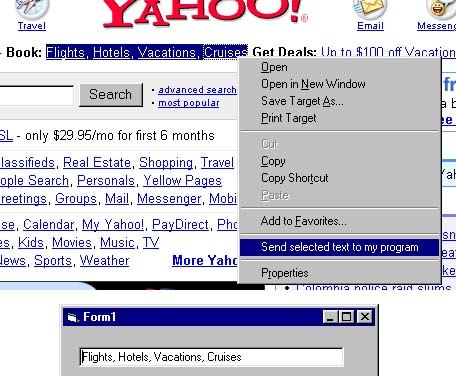



## \[\[\* Run your exe from Internet Explorer and Send selected text in Internet Explorer to your program

### Description

Adds an option to Internet Explorer Pop Menu, Gets selected text, and sends it to your program.

Easy to set up!! You can also get the HTML from the selected parts of the page, if you modify createRange().Text to createRange().htmlText VOTE OR LEAVE A COMMENT.
 
### More Info
 

             |
---                |---
**Submitted On**   |2002-10-24 02:15:40
**By**             |[Pamela RAI](https://github.com/Planet-Source-Code/PSCIndex/blob/master/ByAuthor/pamela-rai.md)
**Level**          |Intermediate
**User Rating**    |4.3 (139 globes from 32 users)
**Compatibility**  |VB 4\.0 \(32\-bit\), VB 5\.0, VB 6\.0
**Category**       |[Complete Applications](https://github.com/Planet-Source-Code/PSCIndex/blob/master/ByCategory/complete-applications__1-27.md)
**World**          |[Visual Basic](https://github.com/Planet-Source-Code/PSCIndex/blob/master/ByWorld/visual-basic.md)
**Archive File**   |[\[\[\_\_Run\_yo14863610242002\.zip](https://github.com/Planet-Source-Code/pamela-rai-run-your-exe-from-internet-explorer-and-send-selected-text-in-internet-explorer__1-40102/archive/master.zip)

